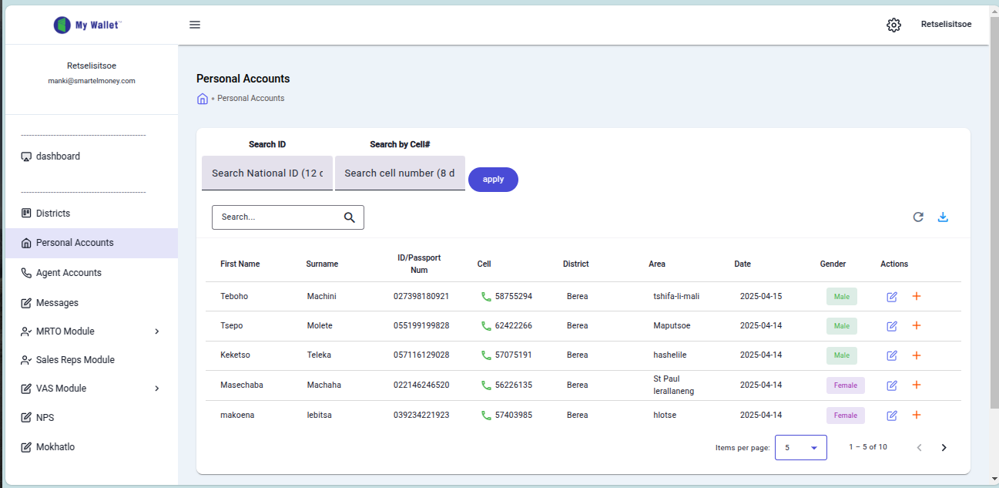

# My Wallet Application - Personal Accounts Screen Documentation

**Documented on:** Tuesday, April 15, 2025

---

**OVERVIEW**

This document outlines the user interface elements of the "My Wallet" application’s "Personal Accounts" section, as shown in the screenshot above.

---

**TOP BAR ELEMENTS**

- **1. Logo and User Info:** Displays the application name "My Wallet" and the logged-in user's email (`retselistsoe@smartelmoney.com`).
- **2. Sidebar Toggle:** A hamburger menu icon (☰) to collapse or expand the left-hand navigation sidebar.
- **3. Settings Icon:** A gear icon (⚙️) for accessing application settings or configuration options.
- **4. User Profile Area:** Shows the logged-in user's name (Retselistsoe), likely linking to profile settings, account management, or logout options.

---

**LEFT SIDEBAR NAVIGATION**

- **5. Dashboard:** Navigates to the main dashboard of the application.
- **6. Districts:** Links to a section for managing geographical districts.
- **7. Personal Accounts:** Accesses the personal accounts section (currently active).
- **8. Agent Accounts:** Navigates to the agent accounts management section.
- **9. Messages:** Opens the internal messaging or communication feature.
- **10. MRTO Module:** Links to functionalities related to the "MRTO" module.
- **11. Sales Reps Module:** Accesses the sales representatives module.
- **12. VAS Module:** Links to the "Value Added Services" (VAS) module.
- **13. NPS:** Navigates to a Net Promoter Score (NPS) tracking section.
- **14. Mokhatlo:** Accesses a custom module or section (possibly a local term).

---

**MAIN CONTENT AREA (PERSONAL ACCOUNTS VIEW)**

- **15. Page Title:** Identifies the current screen as "Personal Accounts".
- **16. Breadcrumb Navigation:** Shows the current location (`< Personal Accounts`), allowing navigation to parent sections.
- **17. Search Tabs:** Tabs to select search criteria: "Search ID" or "Search by Cell#".
- **18. Search National ID Input:** Input field for searching by National ID (e.g., "1,2 c", expects 12 characters).
- **19. Search Cell Number Input:** Input field for searching by cell number (e.g., "8 d", expects 8 digits).
- **20. Apply Button:** Executes the search based on the active search tab’s input.
- **21. General Search Input:** Text field with a search icon (🔍) for general searches across table data.
- **22. Refresh Button:** Icon button (🔄) to reload the table data.
- **23. Export/Download Button:** Icon button (📥) to export table data (e.g., CSV or Excel).
- **24. Data Table:** Displays personal accounts in a tabular format.
- **25. Table Headers:** Column titles: First Name, Surname, ID/Passport Num, Cell, District, Area, Date, Gender, Actions.
- **26. Data Rows:** Rows showing individual account details (e.g., Teboho Machiai’s record).
- **27. Action Buttons:** Icons in the "Actions" column for editing (✏️) or deleting (🗑️) a record.
- **28. Items Per Page Selector:** Dropdown to set records per page (currently 5).
- **29. Pagination Information:** Shows the current range (e.g., "1 - 5 of 10") out of total records.
- **30. Pagination Controls:** Arrows (< and >) to navigate between pages of records.

---