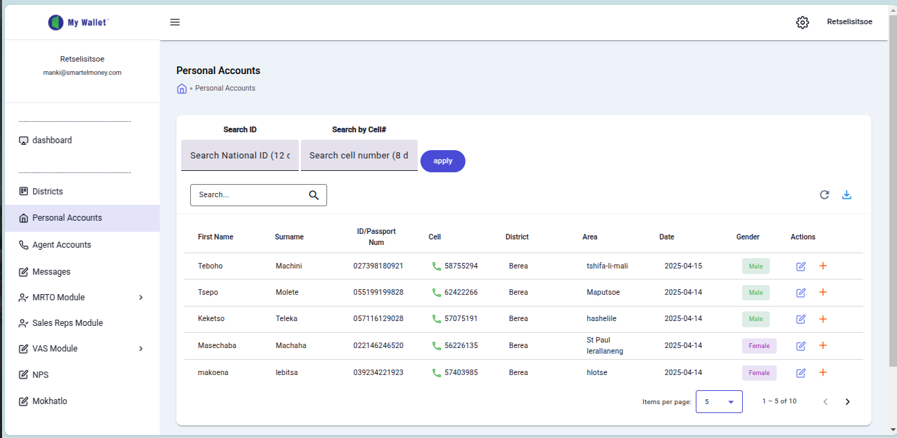

# My Wallet Application - Personal Accounts Screen Documentation

This document describes the user interface elements visible in the provided screenshot of the "My Wallet" application, specifically the "Personal Accounts" section.

## Top Bar Elements

1. **Logo and User Info:** Displays the application name "My Wallet" and the currently logged-in user's email address (`retselistsoe@smartelmoney.com`).
2. **Sidebar Toggle:** A hamburger menu icon (☰) used to collapse or expand the left-hand navigation sidebar.
3. **Settings Icon:** A gear icon (⚙️), typically used to access application settings or configuration options.
4. **User Profile Area:** Shows the logged-in user's name (Retselistsoe) and likely provides access to user profile settings, account management, or logout options.

## Left Sidebar Navigation

5. **Dashboard:** A navigation link to the main overview or dashboard section of the application.
6. **Districts:** A navigation link to a section for viewing or managing geographical districts.
7. **Personal Accounts:** A navigation link to the section for managing individual customer or personal accounts. This is the currently active section.
8. **Agent Accounts:** A navigation link to a section for managing agent accounts.
9. **Messages:** A navigation link to an internal messaging or communication feature.
10. **MRTO Module:** A navigation link for functionalities related to the "MRTO" module.
11. **Sales Reps Module:** A navigation link to a module related to sales representatives.
12. **VAS Module:** A navigation link for "Value Added Services" functionalities.
13. **NPS:** A navigation link, possibly related to Net Promoter Score tracking or a specific "NPS" module.
14. **Mokhatlo:** A navigation link, likely a custom module or section (possibly a local term), for related features.

## Main Content Area (Personal Accounts View)

15. **Page Title:** The main heading identifying the current screen ("Personal Accounts").
16. **Breadcrumb Navigation:** Shows the user's current location within the application hierarchy (`< Personal Accounts`) and may allow navigation back to parent sections.
17. **Search Tabs:** Tabs allowing the user to select the primary search criterion: "Search ID" or "Search by Cell#".
18. **Search National ID Input:** An input field specifically for searching accounts using a National ID number (expects 12 characters, e.g., "1,2 c").
19. **Search Cell Number Input:** An input field specifically for searching accounts using a cell phone number (expects 8 digits, e.g., "8 d").
20. **Apply Button:** A button to execute the search based on the criteria entered in the active search tab's input field.
21. **General Search Input:** A text field with a search icon (🔍) for performing a general search across the data displayed in the table below.
22. **Refresh Button:** An icon button (🔄) to reload or refresh the data displayed in the table.
23. **Export/Download Button:** An icon button (📥) likely used to export the displayed data, potentially into formats like CSV or Excel.
24. **Data Table:** The main component displaying a list of personal accounts in a tabular format.
25. **Table Headers:** The titles for each column in the data table (First Name, Surname, ID/Passport Num, Cell, District, Area, Date, Gender, Actions).
26. **Data Rows:** Individual rows representing specific personal accounts, displaying their details according to the columns.
27. **Action Buttons:** Buttons within the "Actions" column for each row, used for operations like editing (✏️ icon) or deleting (🗑️ icon) the specific account record.
28. **Items Per Page Selector:** A dropdown menu allowing the user to select the number of account records displayed per page (currently set to 5).
29. **Pagination Information:** Text indicating the range of items currently displayed out of the total number of items (e.g., "1 - 5 of 10").
30. **Pagination Controls:** Navigation arrows (< and >) to move to the previous or next page of account records when the total number exceeds the items displayed per page.